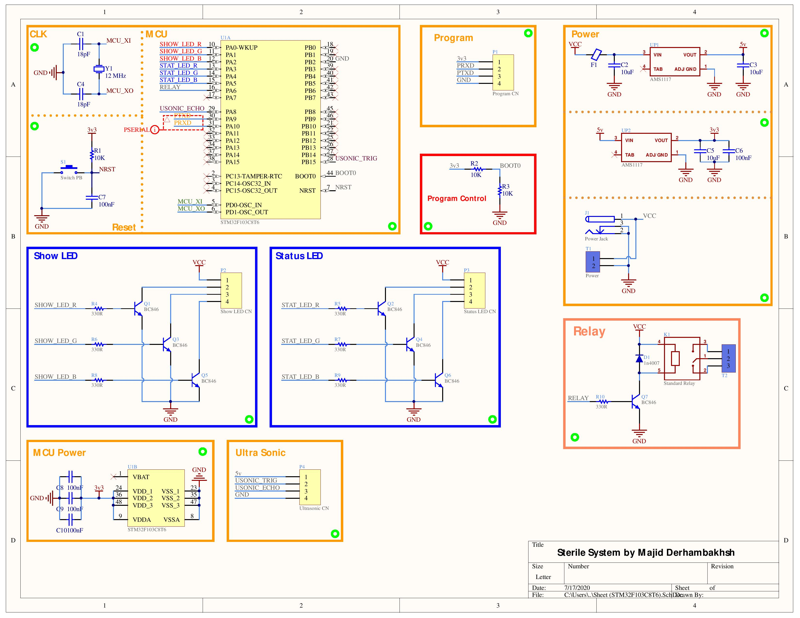
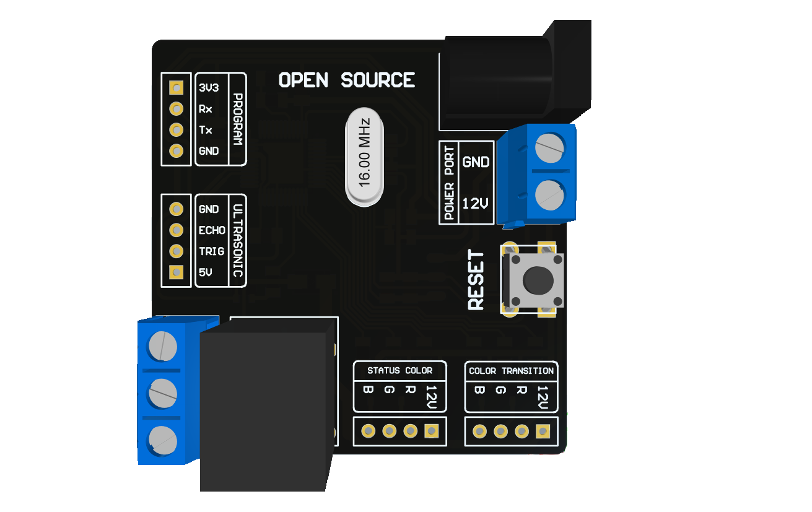

# Sterile Device STM32Base
Sterile system based on STM32F103C8T microcontroller

### Version : 1.0.0

- #### Type : Open Source ~ Embedded Device.

- #### Processor : STM32F103C8T6.

- #### Program Language : C

- #### Compiler : IAR Embedded Workbench.

### PCB Properties :

- #### Type : Single Layer

- #### Size : 40mm * 40mm

- #### Min Trace width : 0.2mm

### Component List :

Part | Package | Voltage | Quantity
------------ | ------------- | ------------- | -------------
STM32F103C8T6 | LQFP48 | | 1
Regulator AMS1117 3.3 | SMD SOT-223 | | 1
Regulator AMS1117 5.0 | SMD SOT-223 | | 1
Resistor 10 KOhm | SMD 1206 | | 2
Resistor 330 Ohm | SMD 1206 | | 7
Capacitor 100 nF | SMD 1206 | 5v | 5
Capacitor 10 uF | SMD 1206 | 12v | 3
Capacitor 18 pF | SMD 0805 | 5v | 2
Ferrite | SMD 1206 | | 1
Diode 1N4007 | SMD | | 1
Transistor BC845 | SMD SOT-23 | | 7
XTAL 12MHz | TH Standard | | 1
4Pin Push Button | | | 1
Baby Millon Relay | TH Standard | Vin | 1
DC Power Jack | TH Standard | | 1
2Pin Terminal | TH Standard | | 1
3Pin Terminal | TH Standard | | 1
4Pin Header | 2.54mm | | 4

### Circuit schematic

### PCB View

#### Developer: Majid Derhambakhsh
